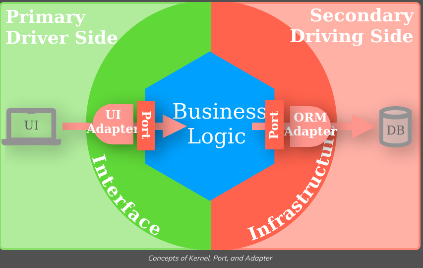

# Hexagonal Architecture

## ORM 
+ Las clases en el código de la aplicación se mapean a tablas en la base de datos. Los **objetos** de estas clases representan **filas** en las tablas. Los **atributos** de las clases corresponden a las **columnas** de las tablas.
+ **Facilita** operaciones CRUD con el mismo lenguaje del programa en vez de querys SQL
    + Para **insertar** un **nuevo registro** en la base de datos, simplemente se **crea** un **objeto** de una clase y se guarda.

+ **Independencia** del programa con el DBMS ya que las sentencias se manejan desde el mismo programa, supongo yo, que si se desea cambiar el gestor, es mucho más fácil ya que solo habría que cambiar los métodos de las clases para hacer las operaciones, más no el resto de código.

+ **SOLID**
+ **JAVA** -> HIBERNATE
+ **PYTHON** -> Django ORM

